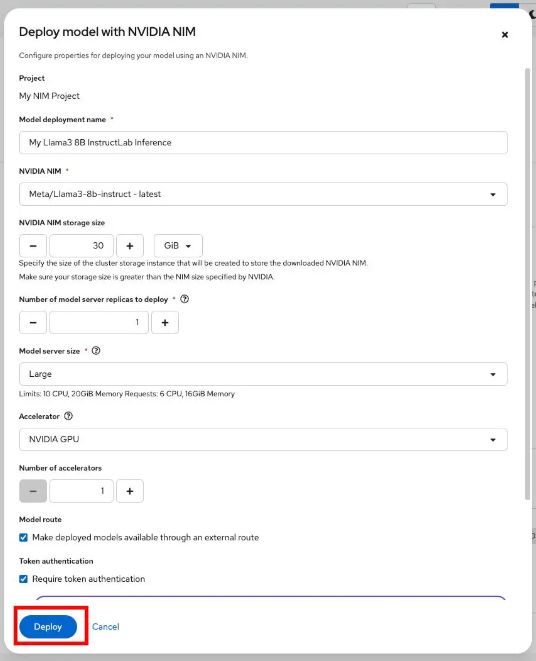
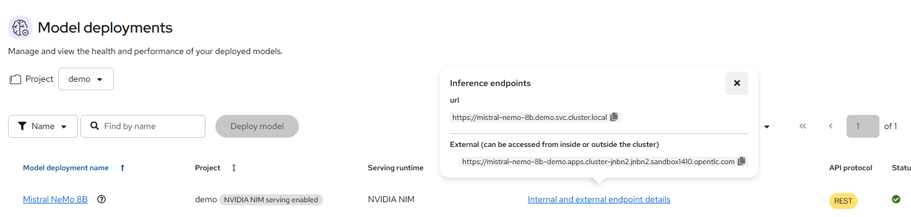

# MVP

[](https://github.com/mateobuscarons/nim-app/actions/workflows/trigger_on_commit.yaml) [](https://quay.io/repository/pbuscaronskrieger/nim-app)

## How to run locally
1. Copy the `.env_example`file and populate with your values:
```bash
cp .env_example .env
```

2. Install dependencies:
```bash
pip install -r requirements.txt
```

3. Run the app:
```bash
python app.py
```

4. Open your browser at: http://localhost:8080

## Build App Using OpenShift
Follow these steps to build the application image directly in OpenShift using the provided resources:

1. Create the namespace:
```bash
oc apply -f build/namespace.yaml
```

2. Switch to the new project:
```bash
oc project demo-project
```

3. Create the ImageStream:
```bash
oc apply -f build/image_stream.yaml
```
4. Set the Git repository: Open build/build_config.yaml and adjust line 14 to point to your Git repository URL.

5. Create the BuildConfig:
```bash
oc apply -f build/build_config.yaml
```

6. Verify the BuildConfig was created:
```bash
oc get bc
```

7. Start the image build:
```bash
oc start-build demo-app
```

Once the build completes, your app image will be available in the internal OpenShift registry under the demo-app:latest tag.

## Deploy on OpenShift
After building the app image, deploy the application using the following steps:

1. Adjust the ConfigMap:
Open `deploy/config_map.yml` and update any configuration values as needed, such as the model name or base API URL.

2. Adjust the Secret:
Open `deploy/secret.yml` and replace the placeholder with your actual API key:

```yaml
stringData:
  api-key: <your-api-key>
```

3. Deploy the application
Apply all deployment-related resources:

```bash
oc apply -f deploy
```

4. Access the application
Once deployed, OpenShift will expose your app via a route. You can retrieve the URL with:

```bash
oc get route demo-app
```

Open the URL in your browser to start using the Chat Assistant.

## Remove Everything
To clean up all deployed resources from your OpenShift environment:

```bash
oc delete project demo-project
```
This will delete the namespace and all associated resources including deployments, services, routes, secrets, and image streams.


# Deploying NVIDIA NIM in OpenShift AI

Deploying NVIDIA NIM with OpenShift AI
To deploy an NVIDIA NIM model that can be used with your application:

### Create Project:

Access the OpenShift AI dashboard
Create a new project to host your NVIDIA NIM model


### Serve Model:

Select NVIDIA NIM as the model provider
Choose the specific model you want to deploy


### Deploy Model:

Configure and deploy the selected model




### Access Model:

Note the External Link (endpoint).

Securely store the API Key provided.




# Change the model within OpenShift

In the Developer Tab, go to ConfigMaps-> demo-app-config -> Actions -> Edit ConfigMap, adjust the parameters with the new Base URL and Model Name.
Go to Secrets, (demo-app-secrets) do the same with the API KEY for the model. 
